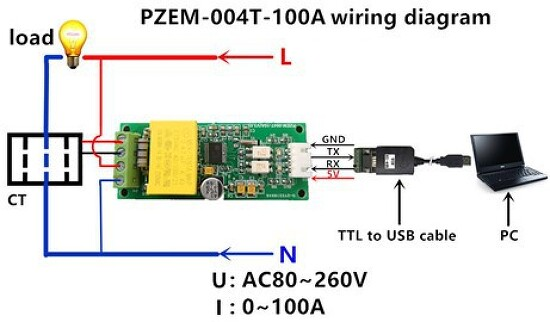

# PZEM-004T 
NodeJS library implementation on Serial Port.

## Basic schema



## Features

- Read all measurement
- Read/Write address
- Read/Write alarm thresold
- Reset energy value
- Do a calibration

## Quick Start
```javascript
const pzem004t = require('pzem-004t')

// init device on port
const device = new pzem004t({ path: "COM1"})

// do some stuff
const data = await device.getMeasurements()
...
...

// close connection
device.close()
````

## Documentation

### Constructor options
| Option name | Type | Required | Default value | Description |
| --- | --- | --- | --- | --- |
| path  | String | true | | Path of serial port, windows 'COM1', unix /dev/ttyS0
| debug | Boolean | false | false | enable debug trace
| address | Number (int) | false | 1 | set slave address

### Methods
 * getMeasurments()
 * getVoltage()
 * getCurrent()
 * getPower()
 * getEnergy()
 * getFrequency()
 * getPowerFactor()
 * getAlarm()
 * getAlarmThresold()
 * getAddress()
 * setAlarmThresold(value: number)
 * setAddress(value: number)
 * resetEnergy()
 * calibration()
 * close()